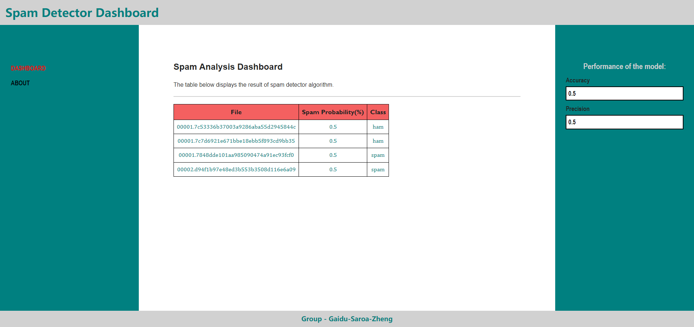

# Assignment 1 - Spam Detector

>## Group Members
>### - Karanjot Gaidu
>### - Xuan Zheng
>### - Amandeep Saroa

## Project Information

This is a Spam Detection project that aims to detect spam messages from a given set of data. The project utilizes RESTful API services for performing the spam detection and uses various files for training and testing the models.

The project is divided into two main parts: training the model and using it to detect spam messages. The training data is taken from various files that contain samples emails. The project uses algorithms to train the model on this data set, which enables the model to identify similar words in the emails that can distinguish between spam and ham.

Once the model is trained, the RESTful API services are used to provide an interface to the user for detecting spam messages. It tests another set of data and processes it to provide a response indicating whether the message is spam or not along with accuracy and precision.

## Project Overview:

The Spam Detection Project is a machine learning-based project that aims to detect spam messages from a given set of data. The project utilizes RESTful API services for performing the spam detection and uses various JSON files for training and testing the models.

The project is divided into two main parts: training the model and using it to detect spam messages. The training data is taken from various JSON files that contain a set of labeled messages as spam or non-spam. The project uses machine learning algorithms to train the model on this data set, which enables the model to identify patterns and features in the messages that can distinguish between spam and non-spam.

Once the model is trained, the RESTful API services are used to provide an interface to the user for detecting spam messages. The user sends a message to the API, which processes the message and provides a response indicating whether the message is spam or not.

The project can be broken down into the following steps:

1. Data Collection: The first step is to collect a sufficient amount of data for training the model. This data is collected from the files provided in train directory.

2. Data Preprocessing: Once the data is collected, it needs to be preprocessed to prepare it for training the model. This includes tasks such as cleaning and storing the data.

3. Model Training: After the data is preprocessed, the next step is to train the machine learning model. This involves calculating how many files contain each word.

4. Model Evaluation: Once the model is trained, it needs to be evaluated on the testing files to measure its accuracy and precision. 

5. RESTful API Integration: Once the model is trained and evaluated, it needs to be integrated into a RESTful API service. The API service should receives data from the files, process them using the trained model, and return a response indicating whether the message is spam or not.

## Improvements

1. Instead of repeating the code in every place, we should make the calculation process as a separate function and call it when needed.
2. Only relevant words which are alphabets are used from the files to train and test the model.
3. To improve the user experience, a more intuitive and user-friendly interface was designed, which also provides the accuracy and precision of the detection.

## How to run

1. Open SpamDetectionServer and SpamDetectionClient separately.
2. Configure Glassfish using the API: `http://localhost:8080/spamDetector-1.0/api/spam`
3. Run the Glassfish server on the computer.
4. Then run the `index.html` and get the results in the form of a table.

## References

1. https://github.com/OntarioTech-CS-program/W23-LectureExamples
2. https://www.w3schools.com/

## Screenshot of the WebPage

### **Note: In the above image, just 4 files were used to train and test the model.**